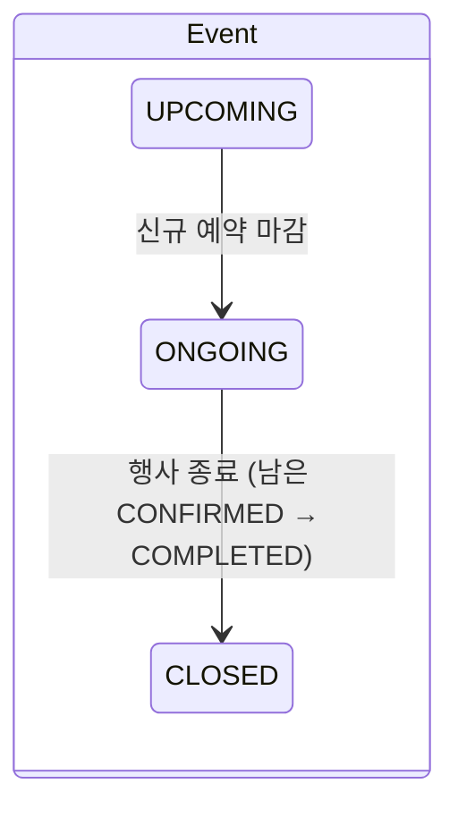
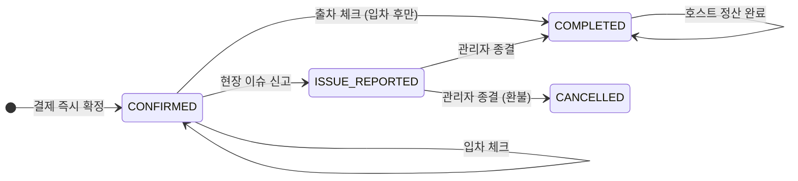

# 🚗 내자리 어딨냐

> 경기장·콘서트장처럼 **특정 일시에 주차 수요가 폭증하는 장소** 근처의 개인·상가 유휴 주차면을,
> **그 행사 시간에 한정해** 미리 매칭해주는 초단기 주차 공유 플랫폼 (Phase 0 파일럿)

📄 **기획서 (Notion)**: [이벤트 한정 주차공간 매칭 플랫폼 기획서](https://app.notion.com/p/3dcff546ac6c80f28dc6f5aeb599f124)

---

## 1. 왜 만들었나

| 문제 | 관찰 |
|---|---|
| **스파이크성 주차 수요** | 대형 경기·콘서트·페스티벌 때 공식 주차장은 일찍 만차가 되고, 주변 사설 주차장은 평소의 3~5배 요금을 받음 |
| **놀고 있는 사유지** | 행사장 도보 5~15분 거리의 주택 마당·빌라 앞·주말 상가 주차면은 그 3~4시간 동안 비어 있음. 하지만 기존 공유 플랫폼은 월 단위·상시 등록 구조라 진입 장벽이 높음 |

**제공 가치**
- **호스트(공간 제공자):** 약정 없이, 비어 있는 몇 시간만 바로 수익화
- **게스트(이용자):** 바가지 없는 사전 확정가로 도보권 주차 자리 확보
- **주최측·지자체:** 행사장 주변 불법 주정차와 교통 정체 완화

**파일럿에서 검증할 가설**
1. 행사장 인근 주민·상가가 3~4시간 동안 자기 주차면을 실제로 내놓을까?
2. 참석자가 도보권 주차면에 고정 패키지 가격으로 미리 결제할까?
3. 차량번호 육안 대조와 원터치 입·출차 체크만으로 분쟁 없이 운영할 수 있을까?

---

## 2. 핵심 기능

| 역할 | 기능 |
|---|---|
| **게스트** | 행사 선택 → 도보 시간순 공간 목록 → 환불 정책 동의 후 **즉시 확정 예약** → 현장에서 원터치 입차·출차 → 문제 발생 시 신고하고 관리자 직통 번호로 연결 |
| **호스트** | 예정된 행사에 공간 등록(심사 대기) → 내 공간별 예약자 차량번호·입출차 현황 확인 (30초 자동 갱신) → 예약 이력 없는 공간 삭제 |
| **관리자** | 행사 등록·수정 → 신규 예약 마감 → 행사 종료 시 남은 예약 일괄 완료 처리 · 공간 승인/반려 · 전체 예약 모니터링 · 현장 이슈 종결(환불 여부 기록) · 호스트 정산 완료 체크 |

한 계정(USER)이 어떤 행사에서는 호스트, 다른 행사에서는 게스트가 될 수 있습니다. 관리자(ADMIN)는 가입 API로 만들 수 없고 시드 스크립트로만 생성합니다.

---

## 3. Phase 0 설계 원칙: "검증에 필요한 것만 만든다"

가설 검증이 목적이라 무거운 인프라는 의도적으로 빼고, 운영 규칙으로 대신했습니다.

| 일반적인 구현 | Phase 0 대체 방식 |
|---|---|
| 지도 SDK·좌표 검색 | 호스트가 입력한 **예상 도보 시간(분)** 오름차순 정렬 |
| 시간 단위 과금 | **행사 타임 단일 패키지 요금** |
| 호스트 승인 대기 | **결제 즉시 선착순 확정** |
| PG 결제·자동 환불 | 가상 결제 + 결제 금액 스냅샷. 현장 결함 시에만 관리자가 **수동 100% 환불** 후 기록 |
| 단순 변심 취소 | **취소 불가 정책** (결제 전 필수 동의). 노쇼로부터 호스트 보호 |
| 웹소켓·푸시 알림 | 수동 새로고침 + 30초 폴링 + 정·부 운영자 **유선 연락망** |
| 본인인증(PASS) | 이름·전화번호·차량번호 직접 입력 |

**Phase 1 전환 기준 (기획서 기준)**
- 노쇼율이 5%를 넘으면 → 호스트 사전 승인제
- 행사당 유선 이슈가 5건을 넘으면 → PG 연동과 부분 취소
- 허위·장난 예약이 3건 이상이면 → PASS 본인인증
- 공간이 30면 이상이면 → 지도 SDK 연동

---

## 4. 기술 스택

| 영역 | 사용 기술 |
|---|---|
| Frontend | Next.js 14 (App Router), React 18, TypeScript, Tailwind CSS |
| Backend | Next.js Route Handlers (API 21개, [`api.yaml`](./api.yaml) OpenAPI 명세) |
| DB | SQLite (Node 내장 `node:sqlite`), 스키마: [`DB.dbml`](./DB.dbml) |
| 인증 | JWT (httpOnly 쿠키 + Bearer), scrypt 비밀번호 해시 |

---

## 5. 구현 포인트

### 데이터 무결성과 동시성
- **중복 예약 방지를 DB가 보장:** `WHERE status != 'CANCELLED'` 부분 유니크 인덱스(partial unique index)로 "공간당 활성 예약 1건"을 강제합니다. 두 명이 동시에 결제해도 한 명만 성공합니다.
- **상태 전이를 조건부 UPDATE 한 번으로 처리:** 입차·출차·신고·종결·정산을 모두 `UPDATE ... WHERE 현재상태 = 기대상태`로 처리하고, 바뀐 행이 없으면 400을 반환합니다. 버튼을 두 번 누르거나 요청이 동시에 와도 두 번 처리되지 않습니다.
- **이중 손실 방어:** 정산은 `COMPLETED` 상태이고 환불도 정산도 안 된 건에만 허용합니다.
- **삭제 보호:** 예약 이력이 1건이라도 있는 공간은 삭제할 수 없습니다.

### 인증·보안
- **권한은 토큰이 아니라 DB 기준:** 요청마다 DB에서 역할을 다시 확인합니다. 권한 변경이나 탈퇴가 바로 반영됩니다.
- **로그아웃 시 토큰 무효화:** 로그아웃하면 `session_version`을 올려서, 다른 기기에서 쓰던 토큰까지 모두 무효가 됩니다.
- **무차별 대입 방지:** 15분 안에 번호당 5회, IP당 20회 실패하면 로그인을 차단합니다(429).
- **계정 존재 여부 비노출:** 없는 번호와 틀린 비밀번호에 같은 응답을 같은 시간에 돌려줍니다. 가짜 해시로 비교해 시간 차이를 없앴습니다.
- **기타:** 로그인 후 원래 페이지로 돌아갈 때 외부 URL로의 이동을 막았고, 운영 환경에서는 쿠키를 HTTPS로만 보냅니다(`secure`). JWT 서명 알고리즘도 고정했습니다.

### 상태 머신





---

## 6. 프로젝트 구조

```
app/
  api/            # REST API (auth, users, events, spaces, reservations, admin)
  events/         # 게스트: 행사 탐색 · 공간 목록/예약
  reservations/   # 게스트: 내 이용권 (입·출차, 신고)
  hosts/          # 호스트: 공간 등록 · 내 공간 현황
  admin/          # 관리자 대시보드
lib/
  db.ts           # SQLite 연결 + 스키마
  api.ts          # 서버 공통 (응답 규격, 인증·인가, 트랜잭션)
  auth.ts         # 비밀번호 해시, JWT, 로그인 시도 제한
  api-client.ts   # 클라이언트 fetch 헬퍼
  seed.ts         # 시드 데이터
scripts/
  migrate-users.ts  # DB 시딩 (npm run db:seed)
  smoke-api.ts      # 전체 API 시나리오 점검
api.yaml          # OpenAPI 명세
DB.dbml           # DB 스키마 (SQL DDL + ERD)
```

---

## 7. 로컬 실행

Node.js 22.13 이상이 필요합니다 (`node:sqlite` 사용).

```bash
npm install
cp .env.example .env.local   # JWT_SECRET 채우기: openssl rand -hex 32
npm run db:seed              # data/app.db 생성 + 테스트 데이터 적재
npm run dev
```

| 역할 | 전화번호 | 비밀번호 |
|---|---|---|
| 게스트 | 01011111111 | guest1234 |
| 호스트 | 01022222222 | host1234 |
| 관리자 | 01099999999 | admin1234 |

- **DB 초기화:** 서버를 끈 상태에서 `rm data/app.db && npm run db:seed`
- **API 점검:** `BASE=http://localhost:3000 npx tsx scripts/smoke-api.ts`
  - 로그인·가입·예약·입출차·신고·환불·정산·행사 종료와 권한 오류를 한 번에 확인합니다.
  - DB를 변경하므로 끝나면 초기화하세요.
